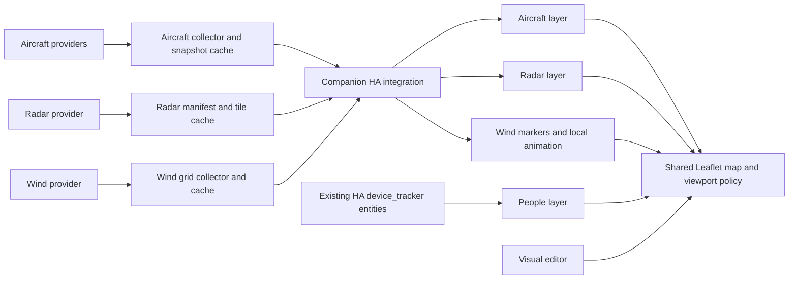

# Aviadilo: aircraft, weather radar, wind, and household locations

Researched and drafted 2026-09-06. This revises the project direction after the user approved the previous stack and companion integration, then expanded the scope. It is input to initial planning, not an approved implementation specification.

## Revised product

Build one map with independently selectable aircraft, weather radar, wind, and people layers. Retain TypeScript + Lit + Vite + Leaflet and the Python HA integration. The shared map owns its viewport, controls, theme, and selection; layers supply their own data, drawing, settings, and freshness status.

The first complete release should cover the requested layers together, including static and animated wind. Intermediate slices can introduce them in sequence. Other geographic information can follow the same architecture later, without committing this release to every possible map feature.

The original aircraft research remains useful in [initial-options.md](initial-options.md). The explicit user decisions are captured separately in [revised-direction.md](../idea/revised-direction.md).

Provider decision after the Claremont spike (2026-09-06): **radar = RainViewer (default), NOAA MRMS, NOAA KSOX; wind = DWD ICON global only**. This supersedes earlier candidate recommendations. See [the source-quality comparison](weather-source-quality.md) for the historical comparison. Other researched weather sources are outside the selected implementation scope.

## What the new scope changes

| Concern | Revised design |
| --- | --- |
| Product identity | A household map with aircraft, weather radar, wind, and people; one larger kiosk card |
| Data collection | Separate aircraft, radar, and wind schedules under provider-specific budgets |
| People | Consume existing HA entities through HA's authenticated frontend data flow |
| Caching | Aircraft snapshots, radar frame metadata/tiles, and bounded wind-vector grids |
| Viewport | One central policy; no individual layer can recenter the map on its own |
| Configuration | Shared integration data settings and per-card visual/layer settings |
| Time | Aircraft and people remain current; radar frame time and wind forecast validity are shown separately |
| Failure handling | One unavailable layer leaves the others usable |

## Research findings

### Existing HA location data is sufficient

The user confirmed all household locations are `device_tracker` entities. Make explicit selection of coordinate-bearing trackers the primary flow; do not require person entities or a new phone-tracking service. Some device trackers provide presence without coordinates, so the editor should explain when a selected tracker cannot be placed on a map. [Device tracker integration](https://www.home-assistant.io/integrations/device_tracker/).

Optionally support `person.*` as another entity type. HA's Person integration already combines trackers and supplies coordinates from its selected source; if used, consume its result without recreating source-priority rules. [Person integration](https://www.home-assistant.io/integrations/person/).

The built-in map card already separates visibility from fitting: it supports entity conditions, optional automatic fitting, and `focus: false` to exclude an entity from zoom calculations. Its documented default zoom can be overridden to fit all visible markers, which is the behaviour the user wants to avoid. Aviadilo should make a geographical radius filter and a predictable kiosk viewport explicit. [HA map card](https://www.home-assistant.io/dashboards/map/).

HA already distributes entity state to the frontend and supports subscriptions. People need no external polling budget. The integration is principally responsible for new external aircraft/weather requests; normal HA entity updates can reach the card directly. [Frontend data](https://developers.home-assistant.io/docs/frontend/data/), [WebSocket API](https://developers.home-assistant.io/docs/api/websocket/).

### Radar providers

| Provider | Evidence and constraints | Fit |
| --- | --- | --- |
| RainViewer | Free personal/educational access, no key, with visible attribution and recommended client caching. | Selected default. [API terms and caching guidance](https://www.rainviewer.com/api.html). |
| NOAA MRMS | Regional radar mosaic; the Claremont spike captured `conus_bref_qcd`. | Selected radar alternative. [NWS GIS services](https://www.weather.gov/gis/cloudgiswebservices). |
| NOAA KSOX | Santiago Peak single-site radar; the spike captured `ksox_sr_bref`. | Selected radar alternative. Its coverage differs from the regional mosaic. [NOAA layer directory](https://opengeo.ncep.noaa.gov/geoserver/www/index.html). |
| DWD regional radar | DWD documents WMS endpoints for meteorological data and publishes radar data through its open-data service. | Not a California radar priority. This is separate from the user's retained global wind option. [DWD geoservices](https://www.dwd.de/DE/leistungen/geodienste/help/nutzung_geodienste.html?lsbId=621762), [radar data](https://opendata.dwd.de/weather/radar/). |

RainViewer's dated transition notice specifies the January 2026 restrictions: no nowcast or satellite IR, Universal Blue palette only, maximum native zoom 7, and 100 requests per IP per minute. Two hours of past radar at ten-minute intervals remain. Its general API FAQ still makes conflicting claims about nowcasts and limits; use the more specific transition notice for the conservative design. [Transition notice](https://www.rainviewer.com/api/transition-faq.html), [current palette](https://www.rainviewer.com/api/color-schemes.html).

A single read of the public manifest during this research returned thirteen past frames, an empty nowcast array, and an empty infrared array. Its frame paths were opaque identifiers, not timestamp URLs to reconstruct. Treat paths from the manifest as authoritative. This was a schema observation through the web tool, not an end-to-end tile playback or coverage test. [Manifest endpoint](https://api.rainviewer.com/public/weather-maps.json).

The weather-map specification supplies frame timestamps, tile paths, image sizes, and a coverage mask. Its frame timestamp describes composite generation and is not a guarantee that every radar observation was taken at that instant. Show the radar frame time and distinguish no coverage from no precipitation. At closer map zooms, enlarge tiles from the supported native level; do not cap the entire map at zoom 7 or imply the radar gained street-level detail. [Weather Maps API](https://www.rainviewer.com/api/weather-maps-api.html).

### Wind markers and animation

The user values the wind display in their current HACS `weather-radar-card`. Include three presentation choices: arrows, meteorological barbs, and animated flow, with static markers and animation allowed together. Wind is independently enabled and sourced; it should work with any supported radar provider or with radar hidden.

Upstream describes both icon and Canvas2D flow renderers sampling a shared wind grid, fetched in bulk through WCS. This avoids a request for every visible wind icon and gives us an appropriate model for sharing data through the integration. [Upstream wind design](https://github.com/jpettitt/weather-radar-card/blob/main/docs/wind-feature-design.md).

Its provider registry includes DWD ICON/AICON coverage IDs and a regional NWS NDFD wind source. Aviadilo's selected wind adapter is DWD ICON global, whose `dwd__Icon_reg025_fd_sl_UV10M` coverage was exercised in the spike. Other registry entries are research references rather than implementation requirements. [Source registry](https://github.com/jpettitt/weather-radar-card/blob/main/src/wind-source-caps.ts).

One concrete documentation discrepancy: upstream labels its global 0.25-degree product “ICON-D2,” whereas DWD describes ICON-D2 as a regional central-European model. The later [Claremont spike](../spikes/claremont-weather/README.md) successfully downloaded provider capabilities and actual wind data: the selected coverage is named ICON global and has a 0.25° grid. Its model-run time is not confirmed by the text response. Preserve actual served metadata in Aviadilo. [DWD model documentation](https://www.dwd.de/SharedDocs/downloads/DE/modelldokumentationen/nwv/icon_d2/icon_d2_dbbeschr_aktuell.pdf?nn=344870&view=nasPublication).

Open-Meteo was considered during research and is outside the selected source set. Its coordinate API illustrates why a dense vector-field overlay should prefer a bounded bulk grid over point requests for individual markers. [Forecast API](https://open-meteo.com/en/docs), [usage terms](https://open-meteo.com/en/terms).

Proposed wind pipeline:

- Backend fetches a geographical wind grid, normalizes vector components and no-data masks, and shares it with all viewers of that region/time.
- Cache keys include provider, model/run when known, valid time, height, bounds, and sampling resolution. Nearby viewports can reuse a containing grid; pan events are debounced and new areas remain subject to the provider budget.
- Frontend renders static markers or local particles from that grid. Changing animation speed, trail length, or marker colour needs no upstream request. Cap particles/frame rate, stop offscreen work, and respect reduced-motion preferences.
- Start with near-surface wind, typically the provider's 10 m product. Label it as forecast/model wind with its valid time. It must not appear to describe aircraft-altitude winds or measured gusts at the house.
- Convert meteorological “from” direction to movement vectors correctly; animate downwind. Preserve missing cells as missing, rather than painting them as calm. Bound interpolation to valid coverage.
- Refresh at provider publication/valid-time boundaries, with a provisional hourly data cadence where appropriate. Animation runs independently; do not reuse the ten-second aircraft timer.
- By default wind uses the current valid forecast field while radar history can be scrubbed independently. Display both times; synchronized historical wind playback is additional scope.

Visual controls should include the wind data profile, static style (off/arrows/barbs), animation on/off, marker density/size, opacity, speed units, and bounded particle density/speed/trail length. Show DWD ICON global as the wind source; a source dropdown is unnecessary while only one is supported. A calm static mode and reduced-motion fallback should remain useful on less capable kiosks.

### Prior art and reusable patterns

The current weather-radar-card documentation already describes multiple radar providers and HA person/device-tracker markers. It is useful reference material for provider adapters and interactions. Its public markers documentation includes following a marker; that does not establish our required radius-filter behaviour or a household-wide backend cache. Reuse lessons and evaluate any code reuse explicitly during implementation, rather than embedding several independent map cards. [Radar sources](https://github.com/jpettitt/weather-radar-card/blob/main/docs/data-sources.md), [markers](https://github.com/jpettitt/weather-radar-card/blob/main/docs/markers.md).

Leaflet's panes provide the layering mechanism and let imagery avoid intercepting marker clicks. The existing choice of map library remains suitable. [Leaflet panes](https://leafletjs.com/examples/map-panes/).

## Proposed architecture

The integration owns provider access, request queues, retries, shared caches, and data profiles. The frontend owns presentation, selection, radius filtering of people, and map interaction. An internal layer interface should cover attachment/removal, data updates, visibility, attribution, status, and candidate bounds. Point snapshots, radar tiles, and wind-vector fields retain distinct data types.

Budgets follow the provider's actual scope rather than the layer boundary. If radar and wind share a provider/host allowance, their requests share that limiter even though their update schedules and caches are separate.

Use separate loops: approximately ten seconds requested for aircraft, a proposed five-minute radar-manifest refresh while viewed, wind refresh at provider data boundaries, and event-driven tracker updates. Weather data refresh intervals are not animation speeds.

Start/stop subscriptions per visible layer. If radar is disabled on every card, stop manifest refresh and discard queued tile demand; do likewise for unused wind grids. Hidden browser tabs stop animation and report no active demand. Expiring viewer leases provide cleanup after crashed or disconnected kiosks. A disabled aircraft layer must not prevent weather or people from working.

A people-only card should remain functional without an aircraft or weather profile. External-data layers report their own missing-profile/setup state. Install the companion integration as the normal complete-product path, while keeping existing HA location display independent of external data failures.

### Shared radar tile cache

Sharing the manifest alone does not deliver the user's intended savings: each browser would still fetch every image tile. The proposed integration therefore provides a private, authenticated route for radar tiles as well as metadata.

- Normalize requests into provider, product, frame identifier, tile coordinates, native zoom, size, and rendering options. Identical requests share both cached bytes and any download already in progress.
- Request only tiles needed for the current viewport and selected frames. Load the latest view first, then a bounded animation buffer. Avoid global prefetch or downloading every past frame at every zoom.
- Respect provider caching headers and expiry, cap storage by bytes and age, and drop unused frames. A disk-backed cache is useful for an always-on kiosk, but its size/location are still specification decisions.
- Apply one RainViewer budget across metadata, tiles, retries, profiles, and clients. The project's half-rate rule gives a ceiling of 50 upstream requests per minute under the documented 100/IP/minute limit. Pace requests and account for the rolling window; this is a ceiling, not a target.
- Queue cache misses with bounded concurrency. Cached replay costs no additional upstream requests. Deduplication helps identical views; different viewports or tile options still create additional demand.
- Honour provider cooldowns. Do not route around the limiter by silently switching to direct-browser requests or cycling providers.
- Keep the tile service restricted to supported provider requests, validate sizes/coordinates/response types, and authenticate access. It must not become an arbitrary URL proxy.

For scale, a hypothetical 12-tile viewport over 13 cold frames needs 156 tile downloads before reuse. Even at a ceiling of 50/minute that is over three minutes of downloads, before metadata or retries. This arithmetic motivates a latest-frame-first display and bounded buffering. Actual native-zoom tile counts and cache hit rates must be measured on the kiosk.

RainViewer's caching recommendation supports local reuse, but is not a blanket redistribution licence. Keep this as a household cache, preserve attribution, and validate chosen-provider caching conditions before shipping. Basemap tile policies are separate; do not automatically apply radar-prefetch behaviour to the basemap.

### One viewport policy

Separate three concepts that were previously easy to conflate:

1. **Aircraft collection area:** controls what the provider is asked for.
2. **People visibility radius:** controls which selected HA locations are eligible to appear.
3. **Map view:** controls what the kiosk is currently looking at.

All can default to the same home/zone centre, but have separate sizes. A person must not trigger an aircraft query around their new location. Panning the weather map should not silently expand the aircraft area or redefine the people filter.

Proposed kiosk default: **home-area view**, initially fitting the configured map area. Updating a target never changes zoom or recentres the view. Let users pan/zoom and return with a recenter button. An optional idle-return setting can restore the home view after interaction.

Also offer **fit visible data**: apply filters first, then compute bounds only from eligible point markers and explicitly included zones. Radar and wind never contribute fit bounds. Excluded people, stale invalid positions, historical trails, and accuracy circles never affect fitting. If no eligible markers remain, use the configured home view; if there is one, cap maximum zoom.

If users enable continuous automatic fitting, manual interaction suspends it until a reset or configured idle return. No layer calls `fitBounds` independently. The filter radius stays anchored to its configured geographical centre, not the changing camera centre, preventing a feedback loop.

### People-radius behaviour

The radius control is mandatory. Proposed defaults: enabled with 50 km from `zone.home`, independently editable from aircraft range. Users can choose another zone/fixed point, change distance units, or disable the filter. The new 50 km people default is a proposal, not something the earlier aircraft-default approval established.

For each explicitly selected entity: validate its current location, calculate geographical distance from the anchor, apply the radius test, and only then add its marker to rendering or fit candidates. Include the boundary (`distance <= radius`). Use geodesic calculations with longitude wrapping; zero coordinates are valid numbers.

A nearby person remains visible; a traveller in Tokyo outside the chosen radius contributes neither a marker nor bounds. Returning within the radius makes the marker reappear automatically. Optionally show an unobtrusive count of people outside the area, without drawing or fitting them.

Use the user's explicitly selected `device_tracker` entities. Optional person support must not automatically duplicate a selected tracker with its associated person. Do not derive coordinates from a zone-name string alone. Unknown/unavailable entities with old coordinates should not look current.

If position freshness is available from the location source, use it. HA entity update time is not necessarily GPS observation time; show that distinction. Do not use time since a person's zone state last changed as a movement timer. A strict age-based hide threshold should be optional so a stationary person does not disappear simply for staying home.

People remain within HA's normal authenticated data path; their entity IDs and coordinates are not sent to aircraft/radar APIs. Map tiles necessarily identify viewed regions, so precise-location-free external requests should not be claimed. Radius filtering is presentation behaviour, not a change to HA access permissions.

### Layer order and time

Draw basemap first, radar above it, then wind, geographical context/trails, aircraft, people, and finally selection/popups/controls. Set radar and wind canvases to ignore pointer events so aircraft and people remain tappable. Keep people legible over weather and dense aircraft traffic.

Radar gets its own latest/play/pause/scrub controls and a clearly labelled frame time. Aircraft and people stay live while a past radar frame is selected; do not imply a synchronized historical reconstruction. Global historical replay would need additional data storage and is separate scope.

Track status per layer: connecting, current, stale, unavailable, and outside coverage where detectable. Distinguish a failed radar tile from a valid transparent tile. One failed provider must not replace the whole map with an error card.

## Visual editor and kiosk settings

Every supported option remains graphical. Group the expanded editor into Map, Aircraft, Weather radar, Wind, People, and Advanced. Shared provider credentials/cache/collection settings belong in the integration's graphical options flow; per-card layer presentation belongs in the card editor.

| Group | Settings to add or revise | Proposed behaviour |
| --- | --- | --- |
| Map | Home/zone/custom centre; home-area versus fit-visible view; initial extent; fit contributors; idle return | Home-area view by default; target updates do not move it |
| Layers | Aircraft/radar/wind/people toggles; default visibility; compact kiosk controls | Independent layers on one map; runtime toggles do not rewrite saved configuration |
| Weather | Data profile/provider; opacity; latest versus loop; history duration; frame interval; playback speed | RainViewer default; NOAA MRMS/KSOX alternatives. Optional, initially latest frame; propose 55% opacity and 60-minute loop when enabled |
| Weather context | Frame time; legend; coverage indication; stale state | Provider attribution and time remain visible; no unsupported forecast selector |
| Wind | Profile; DWD ICON global source label; arrows/barbs; animation toggle; marker size/density; opacity; units; particle density/speed/trails | Cached field shared by static and animated display; independent of radar |
| People selection | Tracker picker, optional person support; per-entity name/photo/icon/colour; show labels | Explicit list; device_tracker is the primary flow for this household |
| People geography | Radius enabled; radius value/unit; anchor zone/custom point; count outside area | Radius applies before drawing and fitting; propose 50 km |
| People display | Accuracy circle; home-marker overlap handling; entity details on tap | Accuracy does not change map bounds |
| Aircraft | Existing filters, list, labels, units, trails, and data-profile selection | Retain the previously approved initial set |
| Kiosk | Large touch targets; details panel; optional idle recenter; fullscreen/layout support | Responsive single map; preserve normal dashboard interaction |
| Advanced | Per-layer freshness controls; read-only effective polling/cache status | Display effective limits without offering a bypass |

The weather play interval is an animation setting, not a network poll interval. Radar provider capabilities constrain available history, native resolution, palette, and forecast options; unsupported choices should be absent or explained, not silently ignored.

Proposed default persistence: editor values are saved dashboard configuration; temporary layer toggles and camera movements are session state. Reopening the card returns to saved defaults. Persistent per-user/kiosk overrides can be added deliberately if wanted.

## Revised implementation shape

These are planning stages, not worker-ready slices or authorization to start implementation. The eventual root spec still needs exact contracts, owned files, and verification per slice.

1. **Shared contracts and map foundation:** typed point/raster snapshots, layer lifecycle, viewport/filter rules, and fixture-backed visual editor.
2. **HA integration foundation:** data profiles, provider budgets, subscriptions, authentication, bounded caches, and graphical setup.
3. **People layer:** existing HA device trackers, radius filtering, selection, and kiosk viewport behaviour.
4. **Aircraft layer:** approved provider adapters, shared collection, map/list/trails, and visual settings.
5. **Weather layer:** RainViewer default plus NOAA MRMS/KSOX adapters, metadata and tile transport, shared caching, latest-frame display, then bounded playback.
6. **Wind layer:** DWD ICON global bulk grid collection/cache, normalization, static markers, then local animation and graphical controls.
7. **Combined kiosk verification and distribution:** readability, performance, HA compatibility, restart/reconnect, editor completeness, and install/update packaging.

Split frontend into `src/map`, `src/layers/aircraft`, `src/layers/radar`, `src/layers/wind`, `src/layers/people`, `src/editor`, `src/config`, and transport/shared types. Split the backend into provider adapters and shared scheduling/cache/subscription services under `custom_components/aviadilo`. Freeze each Python/TypeScript protocol as one contract, with both ends owned by the same implementation worker as required by project rules.

Keep the product name Aviadilo for continuity. New layer details stay in project-owned documents; do not change template process files.

## Acceptance examples to carry into the spec

- Aircraft, radar, wind, and people occupy one Leaflet map. Disabling radar leaves wind, aircraft, and people interactive; a weather outage affects only that layer's status.
- A selected person 5 km away appears with a 50 km filter. A person beyond 50 km does not draw or affect fitting. Test the exact boundary, return into range, invalid/unavailable locations, and a far traveller.
- Changing the camera, radar frame, or weather opacity cannot change the people filter anchor or trigger an aircraft-area refresh.
- Home-area mode stays fixed during people/aircraft updates. Fit-visible mode uses only eligible markers and falls back to the configured view when empty.
- Two clients requesting the same radar tile cause one upstream request, including simultaneous cold-cache requests. Different tiles and retries still share the provider budget.
- Cold animation buffering respects memory and request limits, displays useful imagery promptly, and remains cancellable after a layer is disabled.
- Higher base-map zoom uses supported radar tiles enlarged locally, never an unsupported upstream zoom.
- Static wind markers and animation share the same cached field. Two clients do not duplicate identical in-flight grid requests; animation speed changes produce no external requests.
- Wind-vector fixtures verify cardinal directions, unit conversion, map projection, and no-data masks. Reduced motion and hidden tabs stop particle animation without affecting the other layers.
- Scrubbing radar history leaves live target positions live and labels the different times.
- All supported settings can be set, saved, reopened, and previewed graphically without starting duplicate provider traffic.
- Kiosk endurance covers cache bounds, stale tile URLs, delayed providers, reconnection, tab visibility, and touch/readability at the real screen size.

## Remaining planning inputs

The stack, integration, combined map direction, graphical editing, and mandatory people-radius filter are accepted. The user also wants to preserve the appealing wind markers/animations from their existing card. Do not ask the user to approve the accepted foundation again.

The user answered the environment questions: HACS `weather-radar-card`, household locations entirely in `device_tracker` entities, and California/North America. The spike review settled radar choices (RainViewer default, NOAA MRMS, NOAA KSOX) and wind (DWD ICON global only). Use the captured source identities rather than the old card's inaccurate DWD model label.

Still settle supported HA versions/kiosk browser, tile/grid-cache limits, authenticated transport, package/install layout, and remaining behaviour/defaults before approving the implementation spec. Do not reopen weather source selection or the RainViewer default. First-run setup remains incomplete; the completed spike is a research artifact.
