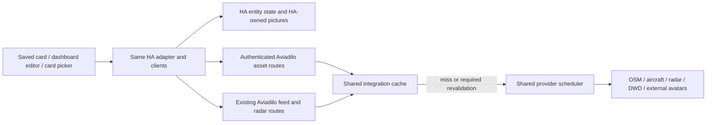

# SPEC: Shared map cache, unified data pipeline, and kiosk presentation

- **Status:** in-progress — the user approved the complete spec on 2026-09-08; slices 1 (asset contracts) and 2 (backend assets) implemented and independently verified. Slice 3 is implemented with automated and native evidence; acceptance awaits the HA preview-remount decision described under Open Questions.
- **Parent:** [ROOT_SPEC.md](ROOT_SPEC.md).
- **Inputs:** `docs/TODO.md`, “Notes from initial completed version,” and the subsequent discussion.
- **Baseline:** published `v0.1.0-dev.2`; HA 2026.9.1, Node 24.20.0, Python 3.14.2, current pinned Chromium tooling.
- **Scope precedence:** this addendum supersedes the parent's synthetic production previews, browser-to-OSM tile fetching, separate wind static/particle controls, and persistent on-card diagnostic/weather panels. Other source, viewport, pacing, licensing and packaging requirements remain in force.

## Summary

Make Aviadilo work as a quiet kiosk map with fast revisits to cached areas. The integration owns public basemap fetching and persistent caching; cards and editors use one production data pipeline for all layers, including cache misses and normal refreshes. Keep layer buttons, Recenter, the optional aircraft list and selection popups. Move weather settings and routine status detail out of the display, retain compact attribution and an error-only indicator, add map themes, and replace the wind style/particles combination with one display mode and a color picker.

## Goals

- Revisiting fresh cached tiles must not wait in the upstream request queue or download them again. Reuse spans cards, browsers and HA restarts.
- Editing, dashboard viewing and card-picker previews use identical production clients, endpoints, cache rules, collection rules and data. The user explicitly rejected a separate edit-mode pipeline.
- Public provider/image requests originate from the integration. HA state, HA-owned image resources and bundled assets remain first-party HA traffic.
- A healthy kiosk card shows useful map content and the agreed controls without routine diagnostic text or weather settings panels.
- Theme, wind mode and color changes are immediately visible in the actual editor preview and require no new provider data.
- Existing saved configurations load and migrate predictably; no manual YAML migration is required.
- Preserve bounded resources, attribution, real missing-data states, manual viewport control and conservative provider usage.

## Non-Goals

- No new aircraft/weather sources, map-provider subscription, API key, map engine, vector-tile stack or offline-download feature.
- No region/zoom pre-seeding, background map warming, global tile archive, or promise that the first uncached view appears instantly.
- No separate cache-only editor, synthetic fallback for production failures, preview-specific freshness, or reduced-data rendering path.
- No simultaneous wind modes, new wind sampling/model detail, flight photos/routes or historical tracker recording.
- No changes to household entity permissions, public sharing, generic URL proxy, or claims of full physical-tablet acceptance from automated tests.
- No change to the current prerelease publication channel in this feature.

## Key Decisions

The user approved the product choices, numeric bounds, API details and migration precedence in this specification on 2026-09-08.

| Decision | Choice | Rationale / alternatives considered |
| --- | --- | --- |
| Tile ownership | Integration fetches and caches OSM Standard raster tiles; browser fetches authenticated HA resources | Fixes repeated serial loads and shares reuse across devices; browser-only caching is insufficient |
| Cache lifetime | Retain basemap payloads up to 90 days since successful fetch/revalidation, within the existing size budget; HTTP headers determine freshness | Retention is separate from when an upstream validation is required; no unconditional 90-day freshness override |
| Cache-hit delivery | Hits bypass upstream pacing and use bounded concurrent local delivery | Existing `TileQueue` delays even browser-cached image starts; that queue must leave production basemap rendering |
| Cold requests | Keep a conservative installation-wide OSM lane: at least 1 second between upstream starts, one in flight | This is Aviadilo's chosen policy, not a claimed published OSM rate limit. It replaces per-page pacing and is shared by all contexts |
| Edit/live behavior — explicit user decision | One production pipeline, including normal fetching on misses, data freshness, permissions and lifecycle | No technical reason for an edit-specific branch has been established. Any proposed exception must be discussed with the user before implementation |
| Kiosk controls — explicit user decision | Retain layer buttons, Recenter and optional aircraft list; retain map/aircraft/people selection popups | Remove clutter without removing the useful interaction the user confirmed |
| Healthy status | No routine count/status paragraphs, source footer under the list, or weather control panels | Detailed status remains available on demand and in integration diagnostics |
| Failure reporting | One compact error/stale indicator that opens a read-only detail popover | Prevents silent failures from looking like clear weather; no permanent healthy-state panel |
| Attribution | One compact visible map-corner attribution area; no standalone provider links below the map/list | Keeps required credits without duplicating them through the card |
| Radar behavior | Latest remains the default; Latest/Loop and playback parameters are configured in the editor | No timeline, slider, buttons or legend panel on the normal card; overlays keep working |
| Theme | Map `theme`: `auto`, `light`, `dark`; auto follows HA, falling back to OS preference when HA supplies none | Theme includes basemap and card chrome. Reuse the same cached tile bytes for both appearances |
| Wind | One `mode`: `arrows`, `barbs`, `particles`; default arrows; layer toggle supplies off | Implements the user's mutually exclusive modes and removes the second visibility gate |
| Wind color | One RGB color for every mode, default `#ecf8ff`, with existing opacity separate | Preserves current appearance and allows the requested color selection |
| Compatibility | Card configuration version 2, v1 reader/migration; existing integration and feed wire schemas remain version 1 | Avoids silently changing v1 wind semantics or unnecessarily changing both ends of the established weather feed |
| Scheduling | Six serial implementation slices with contracts first | Asset transport and composition share files; worktree/build overhead offers little benefit for parallel writers here |

## Design

### 1. One production data path

- Production code must not choose data based on `hass` preview flags, dashboard edit mode, `hui-card-picker` ancestry, or a synthetic `fixtureHass`. Remove that responsibility from `src/map/ha-preview.ts` and `src/map/preview.ts`; remove their production imports. HA's `preview` property may remain accepted for compatibility but has no data-path effect.
- All contexts receive the same normal card configuration and HA context, use the same `AviadiloClient` plus asset client, and exercise normal subscriptions, authentication, cache hits, misses and revalidation. No read-only-cache endpoint, fixture branch, synthetic locations or fake weather is substituted in production.
- Missing HA context, a missing integration, unavailable source, an invalid anchor or denied permission produces the same loading/unavailable state everywhere. HA tracker information can remain usable if provider data is unavailable. Without the integration, a fresh basemap cannot load; never fall back to a direct OSM request.
- Ordinary edits such as title, color, opacity, units and theme do not create a new client, new poller, viewport reset or new provider request. Source/viewport changes use normal demand revision and cancellation handling. Mount, visibility, disconnect and disposal behavior is identical in all contexts.
- Multiple visible editor/picker cards are ordinary viewers. Coalescing and shared cache/pacing prevent duplicated source work; existing viewer/region limits still apply and produce honest capacity errors. Do not special-case those limits by editing state.
- A change to edit/live equivalence is a product decision requiring user discussion, including any platform limitation discovered during native HA verification. Do not quietly reinstate synthetic or cache-only behavior.

### 2. Basemap asset contract

Add a resource client separate from the existing weather subscription protocol. Both resource client and backend endpoints belong to the contracts slice and must be tested together.

| Route / operation | Contract |
| --- | --- |
| `GET /api/aviadilo/basemap/{z}/{x}/{y}` | HA-authenticated; `schema_version=1`, current `generation`; optional `entry_id` selects the sole loaded entry when absent. Integers only, native zoom 0–19, canonical `0 <= x,y < 2**z`. Client normalizes longitude aliases and uses native overzoom above 19 |
| `GET /api/aviadilo/photo` | HA-authenticated; `schema_version=1`, current `generation`, optional `entry_id`, `entity_id` and `picture_key`. Entity must be a permitted `device_tracker`; key is SHA256 of its current entity_picture string. No URL parameter |
| `aviadilo/assets_info` / `aviadilo/assets_changed` | New authenticated WS command returns `{schema_version: 1, entry_id, generation}`; HA event of the latter name carries the same fields after clear. `generation` is an opaque process-instance-plus-counter string. Existing feed info/events are unchanged |
| Successful basemap response | Validated 256×256 PNG; image content type, `nosniff`, HTTP validators and bounded caching headers. Internal cache state is available to test/diagnostic code without household URLs |
| Successful external photo response | Bounded normalized PNG thumbnail; user-private caching rules. See photo rules below |
| Failure | JSON code/message with appropriate 400/401/403/404/409/429/502/503 status; no transparent success image, credentials, upstream URL or response body. Do not confuse a failure with a blank valid tile |

- Define strict request/error schemas and fixtures in `contracts/assets.schema.json`, with generated TS types in `src/data/asset-types.ts`. This new HTTP contract has its own version; do not add unsolicited keys to v1 info/events/commands.
- Extend the HA adapter's resource-path allowlist for these exact routes. Continue authenticated fetch with credentials confined to HA and `redirect: error`; never place HA tokens in resource URLs. Call methods through the current `hass` object while preserving stable connection identity.
- An explicit mismatched/unloaded entry is rejected before cache access. A stale generation gets 409 and a current-generation reconciliation; it never causes a fetch loop against a browser-cached old URL. All requests, including cache hits, require HA authentication. Photo authorization is checked before any cached result is returned.
- Browser asset requests: at most 8 concurrent per HA connection, with a bounded pending queue of 128; obsolete queued items cancel on pan/removal. Backend asset admission: at most 8 concurrent/user and 32 total, shared across the two new routes. Return retryable backpressure rather than unbounded queues.
- These routes do not start aircraft/radar/wind collectors. A basemap-only/people-only view must not register invisible weather demand. Existing radar permissions/revision checks remain unchanged.
- Render only tiles needed by the current visible map. There is no prefetch UI, warming job or automatic traversal of regions/zoom levels. Requests that lose their last interested viewer abort or stop before reaching upstream; cancellation does not reset consumed rate slots.

### 3. Shared basemap cache and fast revisits

- Add a trusted OSM adapter that constructs only `https://tile.openstreetmap.org/{z}/{x}/{y}.png`. Reject redirects and arbitrary hosts; validate response bytes, PNG dimensions and existing 2 MiB tile-size bound before cache publication.
- Cache key: `basemap-v1`, provider `osm_standard`, source style `standard`, native z/x/y and size 256. Exclude user, card, edit mode, theme and viewport revision from the public tile identity. Equivalent wrapped coordinates share a key.
- Reuse the integration's persistent cache, directory safety, atomic writes, validation metadata and LRU eviction. The existing configurable 512 MiB default disk budget is the total public-data budget, including basemap; do not silently add another unlimited cache. Within the existing 64 MiB cache/working-memory budget reserve at most 24 MiB for retained public entries and 8 MiB for retained private photos, leaving 32 MiB for bounded working buffers. Retain existing per-entry/count limits; this is not a cap on the entire HA process.
- Basemap retention is at most 90 days since the last successful fetch/revalidation. It is a maximum under space pressure, not a promise that every tile survives 90 days. Record retention time independently of access time. A cache hit or failed refresh must not advance it.
- Follow upstream freshness directives, `Age`, `Expires` and validators. Expired tiles use conditional requests where supported; 304 updates validation/freshness metadata without replacing image bytes. Honor `no-store`, `no-cache` and `must-revalidate`; the cache must not treat retention as freshness. With no usable freshness headers use a 7-day fallback. Serve stale on errors only when response directives permit it, and mark it stale.
- Identify Aviadilo with a stable, contactable User-Agent. Browser-origin requests use an origin-only Referer; preserve that legitimate origin through the proxy without forwarding dashboard paths, auth or query tokens. OSM requests must not impersonate browsers or hide behind a generic proxy identity.
- OSM policy requires HTTP-aware caching, identification and visible credit, and prohibits bulk/offline prefetching. This design is a bounded cache for actually viewed tiles, not an offline map downloader. [OSM tile policy](https://operations.osmfoundation.org/policies/tiles/).
- The OSM scheduler lane is shared across all cards/devices and survives integration reload as other lanes do. Minimum upstream start interval is 1 second, one request in flight, respecting longer Retry-After/backoff. Identical misses coalesce. Fresh cache hits never enter that lane or consume provider request slots. Integration Advanced settings add `provider_pacing.osm_min_interval_s` (default/minimum 1) and `photo_min_interval_s` (default/minimum 2), both with maximum 3600; existing entries acquire these defaults without changing their other options. Users can only slow these lanes.
- Remove the one-second browser `TileQueue` delay from production. Use the asset client's bounded local concurrency and a connection-scoped LRU for reusable decoded images/object URLs. Combined browser basemap/avatar retention is limited to 32 MiB decoded resources and 128 entries; active visible references are counted, not exempt from memory limits. A very large viewport uses a coarser native basemap tile level, enlarged locally, when needed to keep its required tile set at or below 96 tiles; this must not alter the central map zoom or other layers. Cancel/release obsolete work, revoke evicted URLs and clear private assets on connection/user change. The HTTP/browser cache may provide additional reuse according to returned directives.
- A complete warm viewport must have no intentional per-tile timer. Acceptance target on the recorded test host: 16 cached tiles paint within 1 second, with zero upstream requests and no sequential one-second pattern. A second browser and HA restart repeat the same test against the persistent cache. Record cold timing separately; do not accelerate upstream traffic to satisfy a warm-cache test.
- Disk clear invalidates both persistent and browser-held public asset entries. Responses carry the generation; `aviadilo/assets_changed` invalidates connected clients after a successful clear. One connection-scoped asset service subscribes through HA's normal event mechanism and calls `aviadilo/assets_info` on setup/reconnect to reconcile it, with no periodic poll. Changing process instance also changes generation. Clients reject late responses from an invalidated generation and include the current generation in HA resource URLs, so a clear bypasses obsolete browser HTTP-cache entries. Upstream/public disk identities exclude that generation. Clear also empties private photo retention. Both ends are frozen in slice 1.
- Diagnostics expose aggregate hits, misses, conditional validations, retained bytes, evictions, queue/backoff and generation for basemap. No coordinates, full tile URLs, photo URLs, tracker identities or tokens appear in logs/diagnostic exports.

### 4. Remaining browser fetches and household photos

- Audit production fetch/XHR/image URLs, CSS URLs and imported assets. Aircraft, radar and DWD already use the integration and must continue doing so. Provider attribution links may navigate on a user click; they are not background data fetches.
- HA entity state stays on HA's standard frontend state path. HA-owned same-origin entity_picture resources and bundled icon/font/code assets stay first-party HA resources, with the same behavior in viewing and editing. This is not an edit-mode exception.
- An external entity_picture is fetched by the integration photo route, never directly by an `` in the browser. The server resolves the current URL from HA state after checking that the authenticated user can read that entity; a client cannot supply an arbitrary destination. A changed picture key returns 409 so the client resolves the current state rather than painting an old image. Key generation must also work on local HTTP HA installations; do not require secure-context-only WebCrypto without a bundled fallback.
- External photo fetches permit HTTPS public destinations only, no credentials, redirects, private/loopback/link-local addresses, or DNS rebinding. Validate the actual connection destination. Existing unsupported HTTP/LAN photo URLs fall back to initials with an on-demand reason; do not weaken the fetch guard or broaden into a general proxy. URL/query secrets supplied by an upstream HA integration remain server-side and out of diagnostics.
- Accept bounded raster PNG/JPEG/WebP; reject SVG/HTML, corrupt or excessive images. Limit download to 2 MiB and decoded input to 1 megapixel; normalize to an at-most 128×128 PNG using HA's available image helpers. At most one external photo decode/fetch runs at a time; the global photo lane starts no more often than once per 2 seconds and honors backoff.
- Private photo cache is memory-only, at most 8 MiB/128 entries, accounted within the 64 MiB backend budget. Cache identity includes user, entity and picture revision; check permission and current picture identity before every hit. Honor upstream directives; absent freshness metadata defaults to one hour. No-store photos may serve current consumers but are not retained. Browser photo responses use `Cache-Control: no-store`, and their decoded resources are shared only while referenced by visible markers, so later visits recheck HA authorization against the fast private backend cache. Do not persist photos or their URLs in the public weather/map cache.
- Fetch pictures only after people filtering and only for visible requested markers. Removed/filtered markers release their image references. Photo failure leaves the person's marker/position usable with initials; it does not make the whole people layer unavailable.

### 5. Kiosk presentation and inspection

The healthy card contains optional title, the four layer buttons, Recenter when configured, the map, the optional collapsible aircraft list, selection popups and compact attribution. No separate “kiosk mode” switch is added: this is the standard presentation in every production context.

Remove from the persistent card:

- People-visible/filtered counts, Integration connected, Aircraft current, last-update/effective-refresh footer under the aircraft list, and standalone source links below content.
- The radar timeline/history slider, Latest/Loop/Pause controls, timestamp/status/coverage paragraphs and legend section below the map.
- The entire wind details/settings disclosure. Wind controls appear only in the configuration editor.

Retain data integrity and useful interaction:

- Radar still renders Latest or automatic Loop according to the saved editor configuration. Its frame timestamp, matching legend and coverage detail are available in an editor-only read-only inspection section, and relevant timestamps appear in the failure popover. No settings, playback sliders, persistent timestamps or legends are added to the kiosk map. Choosing Loop is an explicit saved choice; the current-frame/loop policy must be clear in the editor.
- The status indicator is absent when all requested content is current. After an initial 15-second loading grace, show one compact indicator for stale, unavailable, configuration-required, outside-coverage or prolonged-loading states; transient cancelled revisions are not source errors. An empty valid aircraft snapshot is not an error. Disabled layers do not raise warnings.
- On tap/keyboard activation, the indicator opens a read-only popover naming affected layers, last-success/displayed frame/model-valid time, concise cause and recovery guidance. Show no household data in diagnostic exports. Dismiss via Escape/outside click; the closed indicator must not block map/marker interaction.
- There is no always-visible healthy Info toolbar. Detailed healthy source information is inspected through the configuration editor/integration diagnostics. Editor-only read-only inspection subscribes to the same client state and does not create another collector or different cache behavior; the rendered card and its data pipeline stay identical.
- People/aircraft selection popups and the user's configured aircraft columns/detail fields remain. A quiet aircraft list contains rows, selection and an honest empty state, without its routine telemetry footer.
- Source attribution is one visible, compact map-corner row covering the basemap and displayed providers. Keep required linked credits visible, deduplicate them, and allow wrapping within narrow cards. OSM and RainViewer credit must not be hidden in a collapsed panel or settings. In list-only layout, place applicable aircraft credit once at the list edge. [RainViewer API attribution](https://www.rainviewer.com/api.html).
- All card configuration remains graphical. Radar Latest/Loop, history/frame duration and opacity stay in the editor. Troubleshooting counters remain in integration diagnostics; removal of presentation must not remove collection health handling.

### 6. Map theme and wind controls

`map.theme` controls both card chrome and basemap:

- `auto` (label “Follow Home Assistant”): use HA's dark-mode state; use OS preference only if HA supplies no theme information.
- `light` and `dark`: explicit card/basemap appearances.
- Use local styling of the cached Standard raster tiles for dark presentation, scoped strictly to the basemap pane. Starting transform: `invert(1) hue-rotate(180deg) brightness(0.85) contrast(0.9)`. Coefficients may be tuned during visual verification as a reported medium choice; no new tile provider or theme-specific fetch/cache key is introduced.
- Text, controls, attribution and focus indicators must remain readable. Never filter radar palettes, aircraft/people markers, photos, wind colors, popups or the entire map container. A theme change must preserve view and reuse all existing data/assets.

`wind.mode` replaces `static_style` and `particles`:

- Arrows, Barbs and Particles are mutually exclusive. No None/Off item; `layers.wind` is the visibility gate. Enabling Wind on a new card shows arrows.
- `wind.color` is a six-digit RGB value, default `#ecf8ff`, editable through a color picker and valid hex entry. It affects arrow/barb stroke/fill and particle trails. Existing opacity remains separate.
- Arrow/barb modes expose marker spacing/size; Particles exposes count, animation speed and trail length. Common color/opacity/units remain visible. Inactive-mode values are retained for switching back.
- Particle count is 1–1500 when configurable; zero is replaced by the layer visibility toggle. Retain the existing 30 fps ceiling and 8 MiB wind-canvas cap. Static work and model grids retain their current bounds.
- Reduced motion renders static arrows using the selected color while Particles remains the saved mode. This accessibility fallback is the same in editing and live views, does not change stored settings, and is explained in read-only info. Hidden/moving/detached behavior still stops animation; calm zero data remains valid, all-null data unavailable.

### 7. Card configuration migration

Freeze the current schema as `contracts/card-config-v1.schema.json`. The canonical `card-config.schema.json` and generated `CardConfig` become version 2. `normalizeConfig` accepts validated v1 or v2 and returns canonical v2; all editor writes/stubs use v2. Unsupported versions give a compatibility error. Integration config and existing feed messages stay at version 1.

| Legacy value | Canonical v2 result |
| --- | --- |
| `map.follow_theme` true or omitted | `map.theme: auto` |
| `map.follow_theme: false` | `map.theme: dark`, matching the old fixed-dark card |
| `wind.particles: true`, with any static style | `wind.mode: particles`; preserve particle settings, converting count 0 to default 500 |
| particles false/omitted; static style barbs | `wind.mode: barbs` |
| particles false/omitted; static style arrows/off/omitted | `wind.mode: arrows` |
| Missing wind color | `wind.color: '#ecf8ff'` |

- Preserve the saved layer toggle, so a disabled Wind layer stays disabled. A legacy enabled-but-invisible wind configuration now has the default arrow mode. Legacy combined markers+particles become Particles; document this deliberate simplification in release notes.
- Explicit valid v2 theme/mode/color values take precedence when importing a mixed legacy object. Invalid recognized fields produce an editor validation error. Preserve unrelated unknown future fields and meaningful zero/null values.
- Remove consumed legacy keys from v2 output: `map.follow_theme`, `wind.static_style`, `wind.particles`. Remove obsolete panel-presentation flags `radar.show_timestamp/show_legend/show_coverage` and `freshness.show_last_update/show_effective_refresh/show_source_status`. Source age, data filtering and stale-retention values keep their original behavior. Editor inspection and the error-only popover supply the relevant information on demand.
- Do not rewrite the user's stored dashboard just by loading it. Migration occurs in memory; a normal editor save persists v2 through HA. Preserve invalid draft input until corrected; no silent save of a partial configuration.
- An old cached frontend cannot consume v2 card configuration. The next package version changes the bootstrap/module URL; upgrade instructions require HA restart/browser reload before saving new settings. Verify loading untouched v1 dashboards immediately after upgrade.

### 8. Verification and release acceptance

Automated tests stay offline by replacing network boundaries in `dev/` and test fixtures, not by switching production card behavior. Retain a deterministic offline `make run`; adapt its fake HA/backend to the exact production asset/feed contracts. No production import from the synthetic harness and no live OSM pan/zoom automation.

Required evidence:

1. Cache tests cover fresh hits, simultaneous misses, retained reload/restart entries, conditional 304, expiry versus retention, missing headers, no-store/no-cache/must-revalidate, permitted stale-on-error, quota/LRU eviction and clear-generation races. Warm cache delivery succeeds while the upstream lane is busy or in cooldown.
2. Asset route tests cover authentication/entry selection, coordinate bounds/wrapping/native overzoom, body size/type/corruption, redirects, admission limits and cancelled demand. Cache hits never bypass authorization.
3. Photo tests cover entity permission, changed picture key, private-cache separation, external URL/IP restrictions, image bounds and initials fallback. No private URL/body appears in diagnostics or public disk entries.
4. Browser network recording shows zero direct external provider/photo requests in saved, edit and picker contexts. A user-viewed cold tile misses through the same HA route in all three contexts; warm revisits and a second viewer reuse data.
5. Native HA tests compare the same configuration before editing, inside the editor and after Done: real fixture entity identities, selected sources, cache behavior, timestamps and failure handling match. Validate raw picker creation and temporary missing hass/entry without invented data.
6. A 16-tile warm zoom-return test, second browser and HA restart meet the recorded-host sub-second target with no upstream calls. Stress repeated pan/zoom/attach/detach and verify bounded asset bytes/queues/object URLs. Cold acquisition remains paced and is measured separately.
7. Native HA and Chromium validate the quiet healthy card, retained controls/list/popups, compact attribution, error-only indicator/read-only info, dark/light/auto readability and narrow/touch layouts. Theme/color changes generate zero provider calls and do not reset the view.
8. Migrate a matrix of existing v1 settings, including off, markers-only, particles-only, combined wind and count zero; round-trip v2 and unknown future fields. Confirm all visible editor choices affect the same saved/live rendering.
9. Run `make check`, package validation, pinned hassfest/HACS workflow checks, and a 20-minute two-context combined-map run with offline upstream responses and real HA transport. Record browser/HA versions and resource measurements. Native GUI/server work belongs to the orchestrator, not parallel workers.
10. Build `0.1.0-dev.3` with the existing MIT/HACS packaging and checked prerelease workflow; do not move or replace `v0.1.0-dev.2`. Verify the actual published ZIP and upgrade with retained entry/cache/v1 dashboard, then ask the user to assess the kiosk changes. Handle an already-used version through normal versioning, never by overwriting an existing release.

## Implementation Plan

All slices are **(M), [serial]**. Freeze interfaces in slice 1 before behavior work. Workers receive self-contained briefs from `TASK_BRIEF_TEMPLATE.md`; one worker owns both ends of every new HTTP/event contract. Serial ownership may overlap deliberately. The orchestrator alone edits specs, task queue, user/development guides, handoff, DEFERRED and Elefant, and includes `.bishop/` updates in commits.

1. **Asset contracts.**
   - Owned files: new `contracts/assets.schema.json`, `contracts/fixtures/**`; `src/config/{validate,validators.d}.ts`, `src/config/generate.mjs`; `src/data/ha.ts`, new `src/data/{assets,asset-types}.ts`; new `custom_components/aviadilo/assets.py`; `package.json`; `tests/frontend/config/contracts.test.ts`, new `tests/frontend/data/assets.test.ts`, `tests/backend/test_contracts.py`, new `tests/backend/test_assets.py`.
   - Deliver documented request/error/event shapes, both-end validation and interfaces/stubs for asset loading/invalidation. No synthetic/live split in the contract. Keep current card v1 active until slice 4 can migrate every consumer together; existing runtime keeps working while later slices integrate assets.
   - Verify unsupported-version behavior, typed route allowlists and both ends of the HTTP/generation event contract. Regenerate types/validators through native tooling.

2. **Integration basemap cache and bounded external photos.**
   - Owned files: `custom_components/aviadilo/{__init__,assets,cache,scheduler,service,diagnostics,const,config_flow}.py`; new `custom_components/aviadilo/providers/{osm,photos,asset_http}.py`; `custom_components/aviadilo/strings.json`, `custom_components/aviadilo/translations/en.json`; `contracts/integration-config.schema.json`, `contracts/integration-defaults.json`, `src/config/integration-types.ts`; `tests/backend/{test_assets,test_cache,test_scheduler,test_service,test_diagnostics,test_config_flow}.py`, new `tests/backend/providers/{test_osm,test_photos,test_asset_http}.py`.
   - Implement cache-first routes, source identity/headers, retention, conditional validation, scheduler integration, photo authorization/private caching, bounded requests, invalidation and diagnostics. Expose the specified conservative OSM/photo pacing settings in integration Advanced settings.
   - Verify offline route/provider/cache tests and native lint. Use actual HTTP behavior under mocks, including no-store coalescing without retention; no public tile scans.

3. **One frontend pipeline and fast asset rendering.**
   - Owned files: `src/aviadilo-map.ts`, `src/data/{assets,ha}.ts`, `src/map/{basemap,tile-queue,ha-preview,preview,geo}.ts` (delete production preview helpers when unused), `src/layers/people/{layer,model}.ts`; `dev/{fixtures,runtime}.ts`, `dev/{index,runtime}.html`, `dev/ha/custom_components/aviadilo_fixture/**`; `tests/frontend/{data,map,people}/**`, `tests/e2e/card.spec.ts`, new `tests/e2e/assets.spec.ts`; `vite.config.ts` if required for the isolated offline harness; `src/editor/editor.ts` for the copy-only correction describing shared real preview data; `dev/ha/manage.py` and `tests/backend/test_contracts.py` for isolated launcher working-directory verification.
   - Remove synthetic and mode-based production branches, connect asset client/HA state to every context, implement concurrent local hits/LRU/cancellation, route external avatars, and keep standalone fixtures exclusively at test boundaries. Preserve existing weather client revision/lifecycle semantics.
   - Worker verification: unit/lint/build only. Orchestrator verifies warm-cache timing, cold requests, direct-request absence, native picker/editor/view equivalence and reconnect.

4. **Card v2 migration, wind display modes and map theme.**
   - Owned files: `contracts/card-config.schema.json`, new `contracts/card-config-v1.schema.json`, `contracts/card-defaults.json`, `contracts/fixtures/**`; `src/config/{defaults,validate,types,validators.d}.ts`, `src/config/generate.mjs`, new `src/config/migrate.ts`; `src/editor/{editor,map-panel,wind-panel,ha-controls}.ts`, `src/map/{styles,geo}.ts`, new `src/map/theme.ts`, `src/aviadilo-map.ts`, `src/layers/wind/{model,layer,controls}.ts`; `dev/{fixtures,runtime}.ts`, `dev/ha/manage.py`; `package.json`; `tests/frontend/{config,editor,map,wind}/**`, `tests/backend/test_contracts.py`, `tests/e2e/card.spec.ts`.
   - Atomically activate v1-to-v2 normalization and update all affected consumers, fixtures and editor bindings. Render modes exclusively, apply shared wind color, show relevant controls, provide reduced-motion fallback, and implement theme on card/basemap only. No provider URL or data-grid change.
   - Verify migration-to-render behavior, zero-fetch style changes, mode/resource limits, theme contrast and saved/editor matching appearance. Orchestrator runs native HA/touch/sizing checks.

5. **Quiet card and read-only inspection.**
   - Owned files: `src/aviadilo-map.ts`, `src/map/styles.ts`, new `src/map/status.ts`, `src/data/client.ts`, new `src/data/status.ts` if a shared read-only snapshot interface is needed, `src/layers/aircraft/list.ts`, `src/layers/radar/presentation.ts`, `src/layers/wind/controls.ts`, `src/editor/{editor,radar-panel}.ts`; `tests/frontend/{data,editor,map,aircraft,radar}/**`, `tests/e2e/card.spec.ts`.
   - Remove persistent panels/footer/status clutter, retain the agreed controls and list, consolidate attribution, and supply the single compact error-only control with accessible read-only detail. The same worker owns both producer and consumer of editor inspection state; it observes existing client/renderer state instead of opening a new collector. Preserve radar playback policy from the editor.
   - Verify healthy/unavailable/stale/loading states, no hidden credit, keyboard/touch dismissal, map interaction, radar frame inspection, no spontaneous recentering and natural card height.

6. **Packaged upgrade and acceptance.**
   - Owned files: `package.json`, `package-lock.json`, `pyproject.toml`, `uv.lock`, `custom_components/aviadilo/{manifest.json,const.py}`, `scripts/{build_release,check_release}.py`, `dev/ha/{manage.py,custom_components/aviadilo_fixture/**}`, `tests/backend/test_contracts.py`, `tests/e2e/**`, `playwright.config.ts`, `.github/workflows/{check,validate,release}.yml`, `Makefile`.
   - Coherent next development version; update offline/native verification and package requirements for added runtime modules, preserve MIT and existing release gates. No unrelated action/dependency upgrades.
   - Worker runs native lint/tests/build. Orchestrator runs complete checks, isolated HA upgrade, two-context endurance, real release download verification and user-facing acceptance. Update continuity after every slice and stop at the agreed slice handoff cadence.

## Open Questions

The user approved the design, but native slice 3 verification found one platform constraint requiring clarification: HA frontend 20260826.6 replaces custom-card preview elements on every changed configuration, so each replacement gets a new per-element weather client. The shared real-data pipeline and connection-owned asset cache remain unchanged. The user has been asked whether to accept native replacement semantics or specify a general session handoff; the answer is pending. See [HA preview lifecycle](../research/ha-preview-lifecycle.md). If a technical constraint would require different editor/live data behavior, a new public provider, weaker cache/auth guarantees or a materially different resource budget, stop and discuss it with the user before changing this design.

## Deferred / Follow-ups

- Alternative basemap providers, native vector dark styles or self-hosted tile stacks; revisit if locally styled Standard tiles do not meet the user's visual needs. No bulk/offline prefetch support is added by this feature.
- Inherited ROOT_SPEC deferrals remain unchanged. Physical kiosk and HACS upgrade checks described above are acceptance work, not deferred features.

## Change Log

- 2026-09-08 — Created from user TODO feedback. User confirmed retaining layer buttons, Recenter and the optional aircraft list, accepted the proposed kiosk/cache/theme/wind direction, and explicitly required the same pipeline in edit and live modes. Detailed spec remains draft for review; no implementation started.

- 2026-09-08 — User approved the detailed spec. Began slice 1 asset contracts with card/integration/feed v1 preserved; no renewed approval needed for the recorded choices.

- 2026-09-08 — Implemented and independently verified slice 1. Frozen asset schema/paths/error/header/generation contract, generated TS validation/types, connection-owned client coordinator and opt-in authenticated backend interfaces/stubs. Full checks passed 194 frontend + 332 backend + 11 Chromium tests. Current card/integration/feed v1 preserved; production activation/cache work remains slice 2/3.

- 2026-09-08 — User continued after slice 1; began slice 2 integration basemap cache and external-photo service. Existing asset wire contract remains frozen; renderer migration is still slice 3.

- 2026-09-08 — Slice 2 ownership clarified: providers/asset_http.py and its tests may hold shared HTTP policy and bounded image helpers. Test-contract/fixture support may be updated for additive integration defaults. No design or wire-contract change.

- 2026-09-08 — Implemented and independently verified slice 2: activated authenticated asset routes, shared persistent OSM cache with separate freshness/90-day retention, bounded private external photos, conservative pacing, coordinated clear/reload/cancellation and aggregate diagnostics. Full checks passed 194 frontend + 462 backend + 11 Chromium tests. Additional real HA HTTP/WS acceptance delivered 16 warm tiles in 10 ms and 8 ms after reload with zero further upstream requests; successful clear emitted the new generation and rejected old requests. These are backend delivery timings, not painted-viewport measurements. Frontend integration remains slice 3; no release/version change.

- 2026-09-08 — User continued after committed slice 2 (7eb7340); began slice 3, one production frontend pipeline and fast asset rendering. Theme/config migration and quiet presentation remain slices 4/5.

- 2026-09-08 — Slice 3 ownership clarification: correct the obsolete synthetic-preview explanatory text in src/editor/editor.ts; no editor configuration or design change.

- 2026-09-08 — Native slice 3 acceptance found that the dev launcher inherited repository cwd, allowing HA namespace resolution to select checkout modules instead of the installed package/fixture. Added narrow launcher cwd isolation and regression to this slice; stopped the affected run and require confirmed fixture/module origin before repeating native acceptance.

- 2026-09-08 — Slice 3 implementation and parent automated gates passed 201 frontend + 463 backend + 15 Chromium scenarios. Native same-data/photo/picker/Done/reconnect, warm cache/second-browser/restart and real clear evidence recorded in development guide. HA itself recreates preview elements for changed configs; user asked whether to accept native remount semantics or specify a general runtime handoff. No decision assumed and no preview-specific pipeline introduced. One early cold-load anomaly was not reproduced across three additional fresh 32-tile pairs; retain that case for packaged acceptance. No release/version change.
